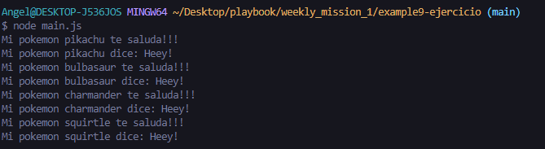

# Resultado del ejemplo 9 - Ejercicio

* Crea la clase.
* Crea un **constructor** que permita recibir un nombre.
* Crea la función **sayHello()**.
* Crea la función **sayMessage()**.
* Exporta la clase para que pueda ser importada en el archivo **main.js**.

